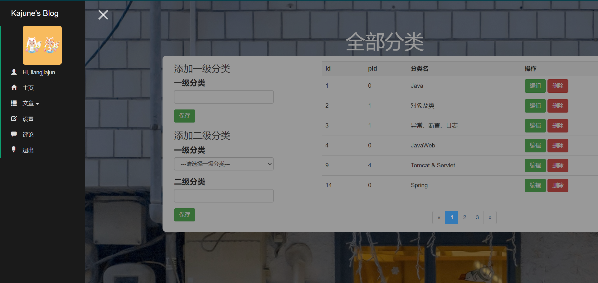

# 关于 SimpleBlog
* Simple 是一个 SSM 初学者的实践项目，体现了 SSM 各个场景的使用；目前使用到的技术栈有：SSM + JSP + Bootstrap；
博客前台首页由 [Clean Blog](https://startbootstrap.com/themes/clean-blog/) 修改所得，后端页面以一个侧边栏作为模板进行实现
* 预览
    * 前台
    
    * 后台
    
* 目前，SimpleBlog项目完成了前后端的基本功能，支持：
    * 博客信息管理
    * 多管理员管理
    * Markdown编辑器
    * 文章两级分类
    * 文章修改
    * 分类修改
* 未来，将会实现更多博客功能，目前计划有：
    * 评论
    * 友情链接管理
* 此外，该博客为首次 SSM 实践部署项目，底层代码存在一定的漏洞和缺陷，效率亦是问题。未来将会尝试使用 SpringBoot 等技术进行重构。

# 部署注意点
* Tomcat中，项目部署路径 Application context 需要设置为 “/”，否则会出现静态资源加载失败的情况

* 需要为上传文件夹配置路径 /uploads

# 致谢
* 感谢 Yanzhao Liu 的 [ForestBlog](https://github.com/saysky/ForestBlog) 的博客源码放出，该源码为我的博客设计提供诸多思路！
    

     